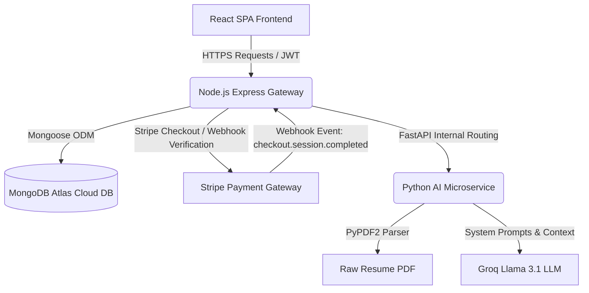

# 🚀 HireMind.ai — Complete Full-Stack AI Interview Preparation SaaS Platform

HireMind.ai is an investor-ready, comprehensive AI-powered career accelerator and mock interview preparation SaaS workspace. Built on a highly scalable, modern **MERN + GenAI** decoupled microservices architecture, the platform empowers job seekers with advanced AI tools, security enforcement, and automated payment gateways to supercharge their hiring journey.

### 🌐 Live Production Environments

You can access and interact with the production services immediately:
*   **🌐 Frontend Application (Live React UI):** [https://hiremindai-0dcs.onrender.com](https://hiremindai-0dcs.onrender.com)
*   **⚙️ Backend API Service (Live Node.js API):** [https://hiremind-backend-9hxn.onrender.com](https://hiremind-backend-9hxn.onrender.com)
*   **🧠 AI Microservice (Python FastAPI Evaluator):** Linked securely inside Render's private low-latency virtual cloud network.

---

## 🛠️ Production Tech Stack

The application is architected across three primary layers:

### 1. High-Fidelity Client (React SPA)
*   **Core**: React 18, Vite (for blazing fast HMR dev server), TailwindCSS (curated palette with sleek neutral grays, warm Apple/Linear-inspired off-whites, and glassmorphic micro-animations).
*   **Interactions & Charts**: `Recharts` for dynamic career performance analytics; `Lucide React` for clean iconography.
*   **Voice Engine**: Built-in HTML5 Web Speech API integration.
    *   *Speech-to-Text (STT)*: Captures verbal answers during mock sessions in real-time, eliminating keyboard typing.
    *   *Text-to-Speech (TTS)*: Synthesizes conversational follow-up questions spoken aloud by diverse local browser voices.

### 2. High-Throughput Gateway (Node.js & Express)
*   **Core**: Node.js, Express.js.
*   **Database ODM**: Mongoose connecting to high-availability MongoDB Atlas cloud clusters.
*   **Authentication & Security**: Stateful JSON Web Token (JWT) authorization, secure passwords hashing (bcryptjs), and CORS protection.
*   **Payment Gateway**: Stripe SDK supporting secure, hosted checkout redirects and robust webhook signing verification.

### 3. Adaptive GenAI Intelligence (Python & FastAPI)
*   **Core**: Python 3.10+, FastAPI, Uvicorn.
*   **LLM Orchestration**: Direct integration with the **Groq Llama 3 API** (`llama-3.1-8b-instant`), delivering ultra-low-latency, structured JSON evaluation trees.
*   **Document Processing**: `PyPDF2` binary stream parsing to extract and clean text contents from uploaded PDF resumes.

---

## 📐 Platform Architecture & Data Flow



### Flow Walkthrough:
1.  **Client Requests**: The React Frontend communicates with the Express API. Secure endpoints are guarded by a JWT Authentication middleware.
2.  **Data Persistence**: Express utilizes Mongoose schemas to write and read accounts, resumes, evaluations, mock sessions, and study checklists from MongoDB Atlas.
3.  **GenAI Evaluations**: When performing heavy calculations (ATS auditing, interview generation, calendar roadmapping), the Express server proxies requests to the Python FastAPI microservice. The AI microservice constructs strict JSON response formats using Groq Llama 3, returning structured data back to Express.
4.  **Monetization Webhook**: When a free tier user upgraded to Premium via Stripe, the checkout success page redirects the user, while Stripe simultaneously fires an asynchronous secure Webhook (`checkout.session.completed`) to the backend, which parses the payload signature and automatically elevates the user's plan to `premium` in the database.

---

## 💎 Custom Premium SaaS Features

### 1. ATS Resume Analyzer & Bullet Playground
Users upload their resume as a PDF and input a target job description. The AI parses the binary PDF, matches skills and roles, and spits out granular alignment scores across:
*   **Technical Fit** (Hard skills, libraries, databases)
*   **Communication Fit** (Soft skills, management, collaboration)
*   **Confidence Fit** (Impact statement strengths, active verbs)
*   **Overall Fit**
The analyzer provides direct actionable recommendations and includes a dynamic text playground where users can re-write resume bullet points and instantly audit them.

### 2. Immersive Mock Interview Simulator with Audio STT/TTS
Provides an active mock simulation tailored to the user's role and duration.
*   **TTS Voice Synthesis**: Spells out questions orally so the user can listen.
*   **STT Voice Transcription**: Transcribes the user's spoken voice in real-time.
*   **Dynamic Follow-Ups**: The AI evaluates the answer on-the-fly and generates context-aware follow-up questions, creating a realistic human-like interview flow.

### 3. Hardened Security & Anti-Cheating Suite
To preserve interview integrity, the platform enforces strict proctoring rules:
*   **Tab Switching Detection**: Uses the HTML5 Visibility API to record when users leave the page.
*   **Focus Loss Tracking**: Detects when users open another application or window.
*   **UI Restrictions**: Disables right-clicks and common Developer Tools hotkeys (`F12`, `Ctrl+Shift+I`, `Cmd+Option+I`).
*   **Auto-Submit Enforcement**: If a user violates rules **3 times**, the session terminates, flags the session as `"Cheating Detected"`, and instantly calculates scores based on progress.

### 4. Tailored Career Roadmaps
Generates interactive, personalized 4-week preparation calendars broken down into days, showing recommended resources, concepts, and challenges. Saved directly as an interactive checklist.

### 5. Stripe Sandbox Fallbacks
Designed with high offline resiliency. If live Stripe keys are omitted or missing, the system gracefully falls back to a sandbox simulator with explicit guidelines, allowing offline testing of user upgrades without crashing the experience.

---

## 📁 Repository Directory Structure

```text
AI interviewer/
├── backend/
│   ├── config/              # MongoDB Mongoose configurations
│   ├── middleware/          # JWT protection, role verification, and error handler blocks
│   ├── models/              # User, Resume, Interview, Roadmap database schemas
│   ├── routes/              # Modular controller endpoints (auth, resume, mock, payment)
│   ├── Dockerfile
│   ├── package.json
│   └── server.js            # Core App Orchestrator & Keep-Awake Pinger
├── ai-service/
│   ├── routes/              # FastAPI controllers (ats, interview, roadmap)
│   ├── services/            # Groq Llama 3 API wrappers and system prompts
│   ├── utils/               # PDF-to-Text binary parsers
│   ├── Dockerfile
│   ├── main.py              # FastAPI main module
│   └── requirements.txt
├── frontend/
│   ├── public/
│   ├── src/
│   │   ├── components/      # Premium Modal, Sidebar, Navbar, and widgets
│   │   ├── pages/           # Landing, Auth, Dashboard, ATS, Prep, Session, Roadmap
│   │   ├── App.jsx          # Routes, Local Storage JWT handler, and Global State
│   │   ├── index.css        # Vanilla CSS, scrollbars, and Outfit font imports
│   │   └── main.jsx
│   ├── Dockerfile
│   ├── tailwind.config.js   # Warm HSL Apple-palette configuration
│   ├── vite.config.js
│   └── index.html
└── docker-compose.yml       # Production-ready docker composition
```

---

## 🛠️ Individual Service Local Setup (Without Docker)

### 1. MongoDB Database Setup
Ensure you have a local MongoDB daemon running on standard port `27017` or use an external Mongo Atlas connection string.

### 2. Core Node.js Express Server Setup
```bash
cd backend
npm install

# Create an environment file in backend/.env:
PORT=5000
MONGODB_URI=mongodb://localhost:27017/hiremind
JWT_SECRET=your_production_ready_secret_key_abc
AI_SERVICE_URL=http://localhost:8000
STRIPE_SECRET_KEY=your_stripe_secret_key
STRIPE_WEBHOOK_SECRET=your_stripe_webhook_secret

# Boot the API server:
npm run start
```

### 3. Python FastAPI AI Service Setup
```bash
cd ai-service
# Create a virtual environment
python -m venv venv
venv\Scripts\activate
pip install -r requirements.txt

# Set environment variables:
set GROQ_API_KEY=your_groq_api_key_here
set PORT=8000

# Boot the FastAPI server:
python main.py
```

### 4. React Client Dev Server Setup
```bash
cd frontend
npm install
# Set target API endpoint (defaults to http://localhost:5000)
# Create a .env:
# VITE_API_URL=http://localhost:5000

npm run dev
```
Open [http://localhost:5173](http://localhost:5173) in your browser.

---

## 🐳 Instant Docker Compose Setup (Recommended)

To spin up the entire multi-service platform in a single line:

1.  Open the global `docker-compose.yml` in the root folder and verify the preset Groq API key in the `ai-service` environment block:
    ```yaml
    GROQ_API_KEY: your_groq_api_key_here
    ```
2.  Run the compose command:
    ```bash
    docker-compose up --build
    ```
3.  The frontend is exposed on port **3000** ([http://localhost:3000](http://localhost:3000)).
    *   The Node API server is mapped on port **5000** ([http://localhost:5000](http://localhost:5000)).
    *   The FastAPI Python server is mapped on port **8000** ([http://localhost:8000](http://localhost:8000)).
